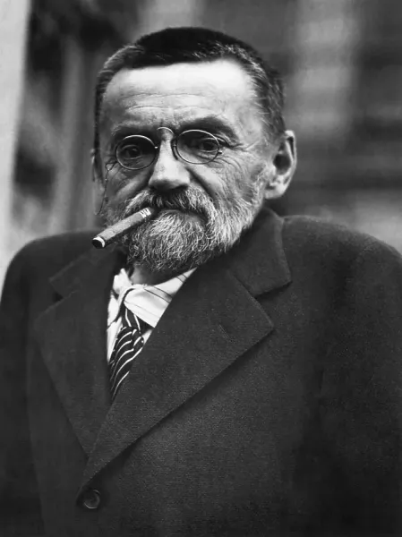
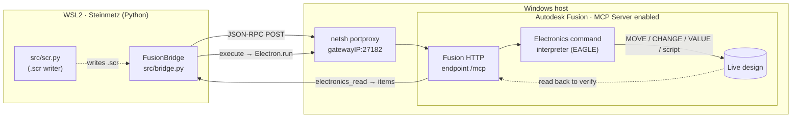
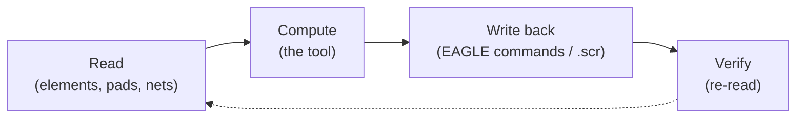

# Steinmetz

**Automation tools for Autodesk Fusion Electronics, driven over Fusion's local
HTTP bridge.**

Steinmetz reads a *live* Fusion Electronics design and scripts changes back into
it — no plugin to install, no MCP client, just JSON-RPC over HTTP and the EAGLE
command line that hides underneath Fusion Electronics. Read the board, compute
something useful, write it back, verify. That whole loop is functional today;
everything else is a tool built on top of it.

## The name

**Charles Proteus Steinmetz** (1865–1923) was the "Wizard of Schenectady" — the
hunchbacked, cigar-chained, four-foot mathematician who fled Prussia as a hunted
socialist, was nearly turned away at Ellis Island, and went on to become the
indispensable genius of General Electric. He gave electrical engineering the
**law of magnetic hysteresis** and the **symbolic (phasor) method** that turned
intractable AC calculus into algebra — the math every EE still learns. Later he
forged artificial lightning in his lab to learn how to tame it.

The story that names this project: a giant generator failed, nobody could fix
it, so GE called Steinmetz. He looked, listened, ran the numbers, and chalked an
**✕** on the casing — *replace the windings there.* It worked. His bill was
$10,000, and when they asked him to itemize it:

> Making chalk mark on generator&nbsp;&nbsp;—&nbsp;&nbsp;**\$1**
> Knowing where to make the mark&nbsp;&nbsp;—&nbsp;&nbsp;**\$9,999**

That is the whole ethos here. The value isn't the action — it's *knowing where
to make the mark.* These tools read the design, find the spot, and make the
change.

## What it does

The fundamental piece is the **bridge**: a verified, plain-HTTP path into a
running Fusion Electronics session, in both directions.

- **Read** the live design — elements and their placement, pad geometry, nets,
  the connectivity graph, package outlines, the board edge. (With a board open,
  the entire EAGLE object model is readable.)
- **Write** it back — Fusion's object API is read-only, but the EAGLE command
  interpreter is reachable over the same endpoint via `Electron.run`, so
  `MOVE` / `ROTATE` / `VALUE` / `CHANGE PACKAGE` / `ATTRIBUTE` / `script …` all
  run headlessly.

> **The write path is a workaround.** As of **2026-06-30** the Autodesk Fusion
> Electronics API is **read-only**. Driving the EAGLE command line (`.scr` /
> `Electron.run`) is how Steinmetz writes today — a deliberate stopgap. If and
> when Autodesk makes the Electronics API read/write, the write layer in
> `src/bridge.py` can be swapped to the native API with no change to the tools
> built on top of it.

On top of that base, tools get added — placement, swaps, checks, exports. The
first proof of concept is a minimal-airwire **parts placer** that reads a live
board, places the selected parts at short-airwire positions against the frozen
parts, respects package `ComponentExcludeTop`/`ComponentExcludeBottom` placement
regions, and writes the moves back over this bridge — collapsing a fan of long
airwires into short ones, end to end.

## The path



The working loop every tool follows:



## Core pieces

| File | Purpose |
|------|---------|
| `src/bridge.py` | `FusionBridge` — the HTTP handshake, `electronics_read` (auto-paginating), `execute`, and `run_eagle` / `run_eagle_batch` / `run_scr` for the EAGLE write path. |
| `src/scr.py` | Generate `.scr` scripts from EAGLE commands, with the safety rules baked in (terminate every command with `;`, reject injection). |
| `src/board.py` | Read a live board into a structured model — elements, connected pads, nets, packages, component-exclude geometry, outline. The shared "what's on the board" layer. |
| `src/selection.py` | Read the user's live selection over the bridge — GROUP-select parts in Fusion and a ULP (`ingroup()`) captures their refs. The "what's selected" layer. |
| `src/place.py` | **Tool:** minimal-airwire placement of the **selected** parts (everything else frozen) — chooses position and rotation jointly, snaps origins to a live Fusion-derived grid, legalizes against component-exclude regions, writes `ROTATE`/`MOVE`s back, verifies. Methodology + before/after: [docs/PLACE.md](docs/PLACE.md). |
| `src/screenshot.py` | Snapshot the board to a PNG (`WINDOW FIT` + EAGLE `EXPORT IMAGE`) for visual verification; Fusion writes to `C:\tmp`, read from WSL at `/mnt/c/tmp` (`~/tmp` on this host). |
| `scripts/evaluate_place.py` | Read-only placement evaluator for live-board experiments; computes the candidate and overlap report without writing `MOVE`/`ROTATE` commands. |
| `docs/fusion-bridge.md` | The verified handshake + write-path recipe and the gotchas behind every rule. |
| `examples/` | `read_design.py` (read + summarize), `run_command.py` (prove the write path). |

```python
from bridge import FusionBridge

b = FusionBridge().connect()                       # gateway IP + handshake, automatic

# read — auto-paginated, never silently truncated
parts = b.electronics_read("electronics.Element", fields=["name", "x", "y", "angle"])

# write — each command terminated with ';', set the unit first
b.run_eagle_batch(["MOVE R7 (44.52 19.42)"], grid="MM")
```

Placement grid snapping uses Fusion's live main grid from a temporary ULP
generated by `src/place.py` at `C:\tmp\steinmetz_grid_main.ulp`. The ULP prints
`B.grid.distance` and `B.grid.unitdist` to
`C:\tmp\steinmetz_grid_main.txt`; the placer reads that file back through the
bridge, converts the value to millimeters, and does this on every placement run.
By default, `src/place.py` snaps origins to one tenth of that live main grid,
`--grid` snaps to the full main grid, and `--nogrid` disables snapping. We use
`grid / 10` as the default fine grid because Fusion's Electronics API does not
expose alternate-grid distance/unit settings, and the Fusion ULP runtime
available through the bridge has not provided a reliable alternate-grid value
either.

## Quick start

1. On the Windows side, enable **Preferences ▸ General ▸ API ▸ "Fusion MCP
   Server"**, open an Electronics document, and set up the port-forward — see
   [`docs/fusion-bridge.md`](docs/fusion-bridge.md) (mind the `0.0.0.0` gotcha).
2. From this repo:

   ```bash
   python -m venv .venv && source .venv/bin/activate
   pip install -e .            # installs the `requests` dependency
   python examples/read_design.py     # connect + summarize the open design
   python examples/run_command.py     # prove the write path (harmless WINDOW FIT)
   ```

   (No install needed to just run the examples — they put `src/` on the path
   themselves; you only need `requests`.)

`steinmetz` is the project/repo name; the source is plain modules under `src/`.

## Status

The bridge — read, execute, and the EAGLE `.scr`/command write path — is working
and verified against a live design, and the first real tool (`src/place.py`,
minimal-airwire placement) runs on top of it end to end. Next up: swaps,
inventory checks, exports.
