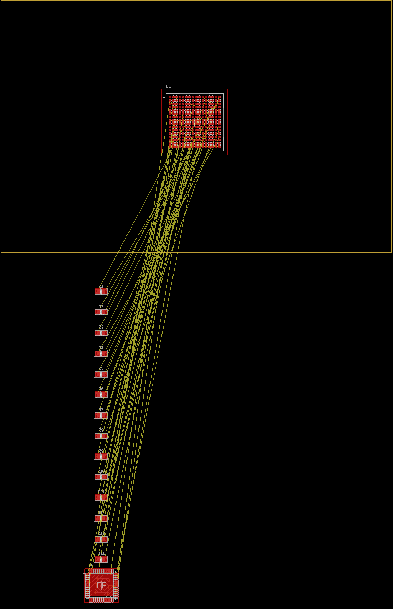
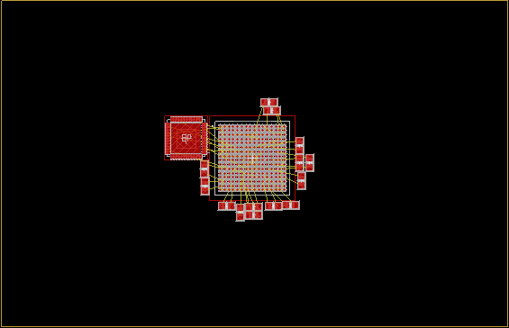

# Placement — minimal-airwire component placement

`src/place.py` is Steinmetz's first tool. It reads a live Fusion Electronics
board and re-places the **selected** parts to minimize ratsnest (airwire)
length, holding every other part fixed, then writes the moves back over the
bridge and verifies them. The selection is read over the bridge (see
`src/selection.py`) — **select nothing and it does nothing**. Placement is
connectivity-driven: it puts each selected part where *its own* nets are shortest
against the fixed board, chooses its rotation jointly, spreads out overlaps, and
lets the parts settle — rather than nudging an existing layout.

## Iterative tightening loop

To tighten a GROUP-selected set of parts until it converges, run the ready-made
`/loop` prompt in [`tighten-placement.md`](tighten-placement.md): start a fresh
agent and enter **`/loop follow docs/tighten-placement.md`**. The invocation is
the same every firing — the prompt is self-contained and tracks progress in
`~/tmp/place_loop_state.json`, running placement passes until one improves airwire
by < 1 mm.

## Before / after

A set of selected parts pulled from a scattered state into a tight ring around
the fixed IC that minimizes airwire, while the rest of the board stays fixed:

| Before | After |
|---|---|
|  |  |

Each run prints the before/after signal-airwire length and crossing count; the
tightening loop refreshes these images from a converged run.

## Methodology

### 1. Read the board into a model — `src/board.py`

`read_board()` pulls the EAGLE object model over the bridge and joins it into
elements, connected pads, nets, packages, and the board outline. The key join:
a net (`Signal`) reaches a pad through `ContactRef`
(`element` + `contact` + `signal`), and the pad's placed global position is on
the `Smd`/`Pad` row keyed by `contact_object_id`. Joining them yields, per
connected pad: **which element, which net, and where it physically sits**. Reads
auto-paginate, so connectivity is never silently truncated.

### 2. The objective — ratsnest length

For each net, the airwire length is the **Euclidean minimum spanning tree** over
its pad positions (`mst_len` in `place.py`) — the same thing Fusion's ratsnest
draws. The cost is the sum over **signal nets only**: power/plane nets (`GND`,
`VCC*`, anything with ≥ 8 pins) are excluded, because they are poured/planed
rather than routed point-to-point — counting them would just drag every
decoupling cap toward the fixed parts. Classification is `is_power()` (name
pattern or high fan-out); extra nets can be excluded with `--ignore-nets`.

### 3. The fixed frame — why something must stay put

Airwire length is **relative**: if every part could move, the global optimum is
"all parts stacked on one point" (airwire → 0), which is meaningless. The placer
resolves this by moving **only the selected parts** and holding everything else
fixed — the unselected parts are the reference frame the selection is pulled
toward. So the selection *is* the input: group the parts you want placed and
leave the parts you want as anchors out of the group. `--only REF…` overrides the
live selection with an explicit ref list. Select nothing → nothing moves.

### 4. Optimal-region placement — three steps

Placement of passives around an IC is *separable*: a 2-port R/C straddles two
pads on the (fixed) IC and shares no net with the other movable parts, so **its
airwire depends only on its own position and rotation** — the parts interact only
by not overlapping. That makes the airwire minimizable **one part at a time**,
which is what the placer does (`Placer.place`):

**a. Ideal.** Each selected part is dropped at the `(rotation, centre)` that
minimizes *its own* airwire, legal against the frozen anchors only — overlaps
*between* movable parts allowed for now. Per part this is an outward **ring**
search from where its connections want its origin (the "implied-centre centroid",
`_implied_centers`), swept over `--rotate` orientations, scored by
`_part_airwire_at` (`_optimal_region`). This lands each part in the legal crescent
just outside the IC with its pads pointing back at the balls they connect to —
the true per-part optimum, and the airwire **lower bound**.

**b. Spread.** The ideal spots overlap where several parts want the same edge, so
`_spread` separates overlapping hard-geometry boxes by **minimal displacement**
(pushing each pair apart along its axis of least penetration, keeping parts
on-board), so they barely leave their ideal.

**c. Settle.** `_settle` is coordinate descent: it re-places each part at its
optimal region against **all** the others, iterated, recovering the airwire the
spread cost and letting the parts settle into the packed arrangement — the one
coupling (two parts contending for one spot) that the per-part step can't see.

"Fits" throughout means no `ComponentExcludeTop`/`ComponentExcludeBottom`
overlap plus `--clearance`, and inside the board outline by `--margin`. The
exclude-layer geometry is the package author's intended placement keepout. If a
package lacks it, the placer falls back to package contacts and observed SMD pad
sizes with a small body pad; it does not use the raw `Package` bounding box for
placement legality because that bbox often includes text and drawing artwork. A
short **quench** (`improve`) then does a final nudge / rotate /
same-footprint-swap polish on the full objective (airwire + crossings, plus the
optional terms in §5).

### 5. Rotation and optional spreading

Rotation is **always on** and chosen **jointly with position** in step 4a:
`--rotate DEG` sets the step (default **90°** → 0/90/180/270; `--rotate 1` lets
parts rotate freely in 1° steps). Each candidate orientation reorients a part's
own pads, so the search picks the one whose pads line up best with the balls they
connect to. Mirrored (bottom-side) parts are left un-rotated — their angle field
may not capture the flip — and the pad-position gate (§6) is the real check that
the transform matched Fusion.

The objective is **airwire length + `--cross-weight`·crossings** (default 2.0), so
length stays primary and crossings only break near-ties; the before/after
crossing count is printed alongside the airwire numbers. Two optional terms,
**off by default**, add routability headroom when you ask for them:

- `--halo-weight` — a soft component-exclude spreading penalty (scaled by √pin-count,
  above the hard `--clearance`) that leaves fanout room around dense parts;
- `--edge-weight` — a soft board-edge margin.

They trade a little airwire for spacing; leave them at 0 for the tightest layout.

> **Command quirk:** the part name must be **single-quoted** for `ROTATE`
> (`ROTATE R90 '<part>'`). A bare `ROTATE R90 <part>` is silently a no-op — the
> parser doesn't bind the object — even though `MOVE <part> (x y)` takes the name
> bare.

Rotation depends on how Fusion applies `ROTATE Rn` to pad coordinates —
counter-clockwise-positive, `(dx,dy) → (-dy,dx)` for 90° (confirmed live). Right
angles use an exact integer remap; other steps fall back to trig, with the
0.1 mm pad-position tolerance absorbing the round-off.

### 6. Write back and verify

For each touched part the placer emits a relative `ROTATE Rn '<part>'` (preserves
mirror state) followed by `MOVE <part> (x y)` — both pivot on the element origin,
so order does not matter — and fires them as **one terminated batch** over the
bridge (`run_eagle_batch(..., grid="MM")`). It then re-reads the board and
verifies twice: every element **landed within 0.05 mm**, and — the stronger gate
— each touched part's **predicted pad positions match the board's actual pads**
(`_pads_match`). A mismatch (wrong angle sign, an unhandled mirror) is flagged
loudly rather than silently shipped. Changes are unsaved until you save in Fusion
— reopening reverts them.

## What it does *not* do

This minimizes airwire **length** (with crossings as a secondary lever). It does
not consider:

- **routing congestion** beyond the optional halo term, or datasheet-mandated
  layouts (switcher hot-loops, decoupling caps at specific power pins);
- **coupled placement** — parts that share nets with each other (buses, chains,
  diff pairs). The per-part step assumes separability; strongly-coupled sets get
  a weaker seed (the quench and settle still run, but there is no global
  co-optimization);
- constraints *outside* the board file — thermal spreading, EMI zoning,
  connector/mechanical positions.

So treat the result as a fast, sensible **constructive placement** — a strong
starting point, not a finished layout. It is deterministic and idempotent:
re-running on an already-placed selection emits ~no commands.

## Usage

```bash
python src/place.py                 # place the current selection (90° rotation), write + verify
python src/place.py --rotate 1      # let parts rotate freely, in 1° steps
python src/place.py --only R4 R5 R8 # override the selection with an explicit ref list
python src/place.py --refine-only   # quench the current layout in place, no re-seed
python src/place.py --ignore-nets "VCC*" "3V3"
python scripts/evaluate_place.py    # read-only: compute/report candidate, write nothing
```

| flag | default | meaning |
|------|---------|---------|
| `--rotate DEG` | 90 | rotation step in degrees, chosen jointly with position (`1` = free) |
| `--cross-weight MM` | 2.0 | airwire-crossing penalty (length stays primary) |
| `--only REF…` | – | place these refs instead of the live selection |
| `--ignore-nets PAT…` | – | extra net-name patterns to exclude from airwire scoring |
| `--clearance MM` | 0.1 | ComponentExcludeTop/Bottom gap between parts |
| `--margin MM` | 1.0 | keep parts this far inside the board edge |
| `--refine-only` | off | quench the current layout only (no re-seed); bounded displacement |
| `--pos-step MM` | 0.5 | position granularity of the search and nudge |
| `--span MM` | 3.0 | how far past the first legal ring the search explores |
| `--nudge MM` | 1.5 | quench nudge half-window |
| `--quench-passes N` | 6 | max quench sweeps |
| `--max-displacement MM` | – | cap each part within this of its original position |
| `--halo-weight W` | 0 | soft component-exclude spreading penalty for fanout room (off) |
| `--halo-gap MM` | 0.5 | base spreading gap, scaled by √pin-count |
| `--edge-weight W` | 0 | soft board-edge margin penalty (off) |
| `--edge-margin MM` | 2.0 | edge soft-margin distance |

GROUP-select the parts to place first (see `src/selection.py`), and run with a
board open in Fusion and the bridge reachable (see
[fusion-bridge.md](fusion-bridge.md)).

Use `scripts/evaluate_place.py` for live-board experiments when you want the
same metrics and overlap checks without applying any `ROTATE`/`MOVE` commands.
